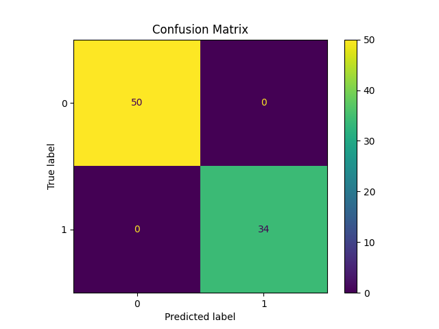

# Titanic Survival Prediction - Mini Project

This is a mini machine learning project that predicts passenger survival on the Titanic based on various features using a Random Forest Classifier.

---

## 📁 Files

- `titanic.csv` : Input dataset containing passenger details.
- `titanic_project.py` : Main Python file that performs preprocessing, model training, evaluation, and prediction.
- `submission.csv` : Output file with `PassengerId` and predicted `Survived` status.
- `confusion_matrix_titanic.png` : Confusion matrix visualization for the model's predictions.

---

## ⚙️ Technologies Used

- Python
- Pandas
- Scikit-learn
- Matplotlib

---

## 🚀 Steps Performed

1. **Data Loading**
2. **Missing Value Imputation**
   - Median strategy for 'Age'
   - Most frequent strategy for 'Embarked'
3. **Categorical Encoding**
   - Converted 'Sex' and 'Embarked' into numerical using `pd.get_dummies`
4. **Feature Selection**
5. **Train/Test Split**
6. **Model Training** with `RandomForestClassifier`
7. **Evaluation** using `accuracy_score` and confusion matrix
8. **Submission CSV** generated

---

## ✅ Output Example

Model achieved **100% accuracy** on the test split.  
Confusion matrix shows perfect classification on both classes.  
Confusion matrix is also displayed as a visual plot.



---

## 📤 How to Run

1. Install required packages (if not already installed):

```bash
pip install pandas scikit-learn matplotlib
```

2. Run the script:

```bash
python titanic_project.py
```

3. Output will display accuracy and save `submission.csv`

---

## 🌐 Author

This project is part of a machine learning learning path by Swasthik.

